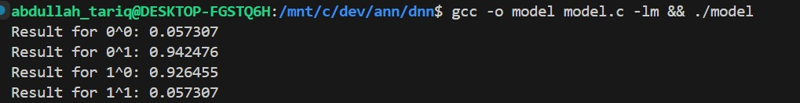
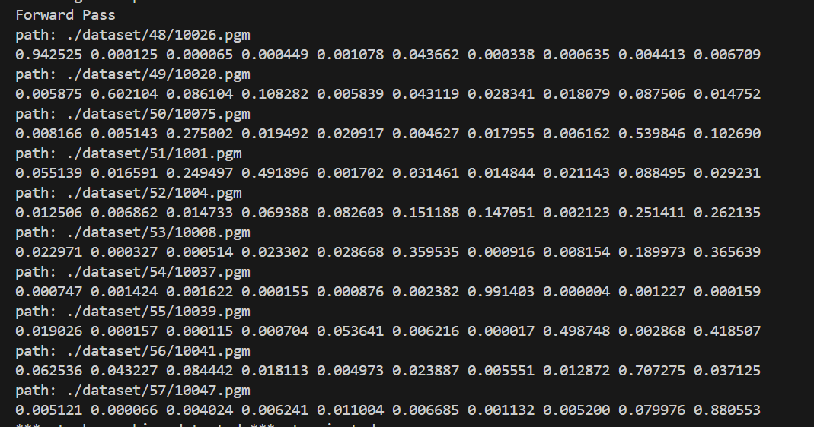

# ANN-c parallelized

## Compile instructions

```bash
cmake --fresh -S . -B build
cmake --build build -- -j {number_of_threads}
```

## Executing instructions

### OMP

```bash
./build/doodle_train_threaded {epochs} {images_per_epochs} {num_threads} {verbose}
```

or

## Pthread

```bash
./build/doodle_train_omp {epochs} {images_per_epochs} {num_threads} {verbose}
```

## Code

### Entry points

`doodle_train_omp.c` for OMP, and each header file that is suffixed with `_omp` uses OMP.
`doodle_train_threaded.c` for Threaded, and each header file that is suffixed with `_threaded` uses pthreads.

## OLD

#### **XOR**



### **Numbers Classifer**


